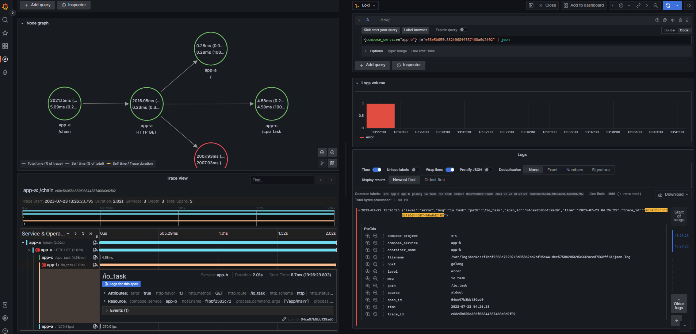

# golang-observability

***[OpenTelemetry 란 무엇인가?](https://medium.com/@dudwls96/opentelemetry-%EB%9E%80-%EB%AC%B4%EC%97%87%EC%9D%B8%EA%B0%80-18b6e4fe6e36)***

***[OpenTelemetry Metrics 통한 서비스 지표 측정 및 수집하기](https://medium.com/@dudwls96/opentelemetry-metrics-%ED%86%B5%ED%95%9C-%EC%84%9C%EB%B9%84%EC%8A%A4%EC%A7%80%ED%91%9C-%EC%B8%A1%EC%A0%95-%EB%B0%8F-%EC%88%98%EC%A7%91%ED%95%98%EA%B8%B0-e8bca31c1619)***

***[OpenTelemetry Traces 통한 Application 모니터링 하기](https://medium.com/@dudwls96/opentelemetry-traces-%ED%86%B5%ED%95%9C-application-%EB%AA%A8%EB%8B%88%ED%84%B0%EB%A7%81-%ED%95%98%EA%B8%B0-ac1e4c8a0749)***

***[OpenTelemetry Logging 통한 로깅 상태 추적하기](https://medium.com/@dudwls96/opentelemetry-logging-%ED%86%B5%ED%95%9C-%EB%A1%9C%EA%B9%85-%EC%83%81%ED%83%9C-%EC%B6%94%EC%A0%81%ED%95%98%EA%B8%B0-a920725c1c3a)***

***[OpenTelemetry, Grafana, Loki, Tempo, Prometheus를 활용한 Flask Observability 구성하기](https://medium.com/@dudwls96/opentelemetry-grafana-loki-tempo-prometheus%EB%A5%BC-%ED%99%9C%EC%9A%A9%ED%95%9C-flask-observability-%EA%B5%AC%EC%84%B1%ED%95%98%EA%B8%B0-9efc01495287)***

***[OpenTelemetry, Grafana, Loki, Tempo, Prometheus를 활용한 Golang Observability 구성하기]()***

#### Dashboard screenshot:

